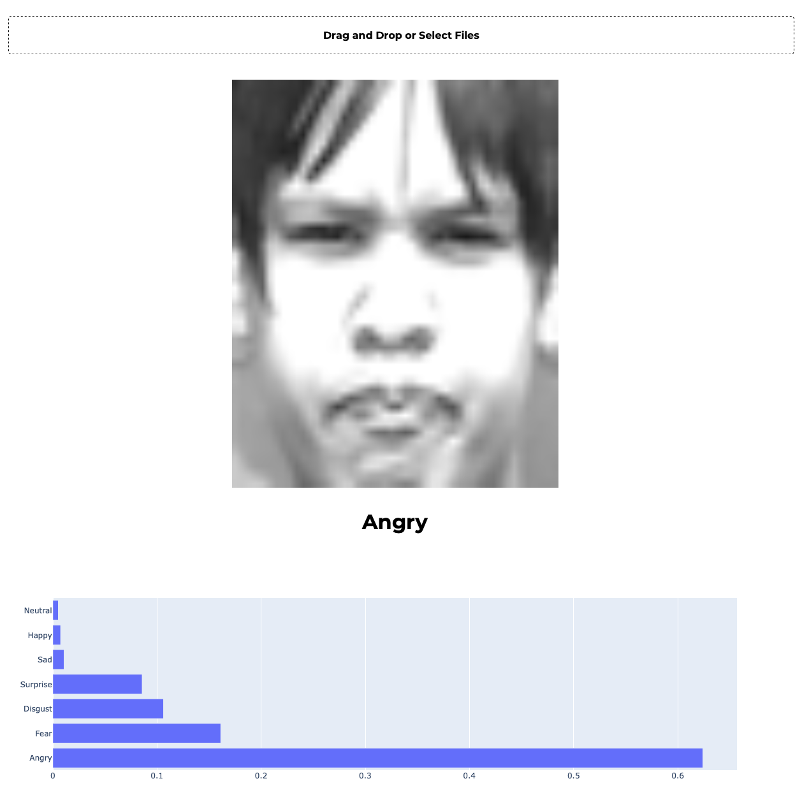
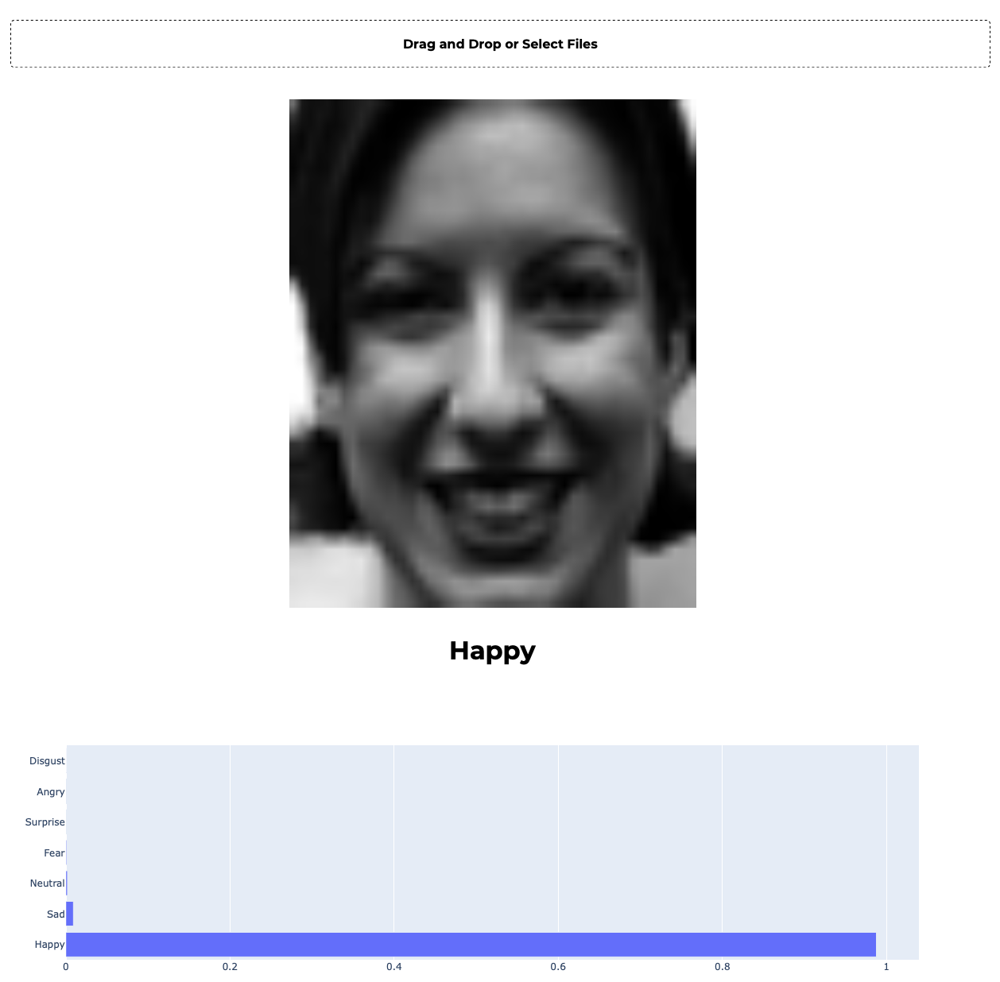
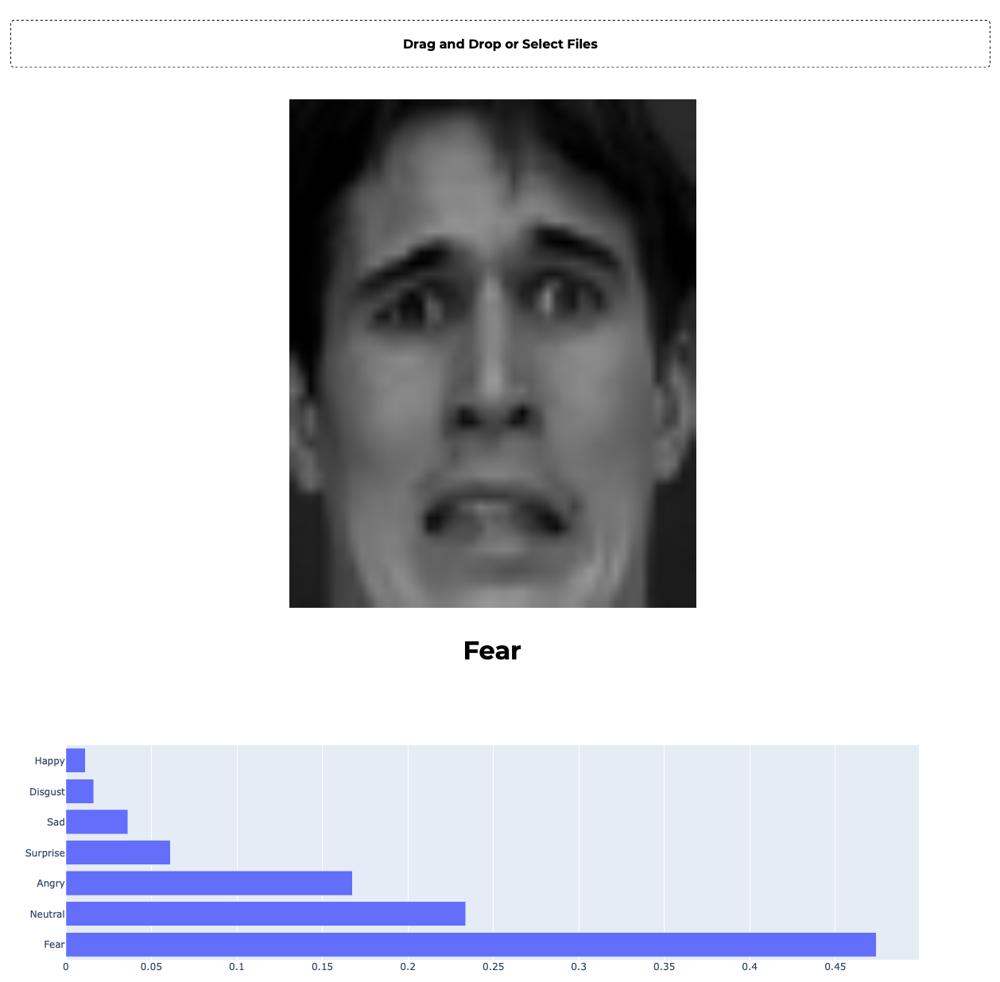

# Affective Computing - Final Project
- **TASK:** Facial expression recognition from images
- The entire model training is visible in the Notebook
    - In the end the custom architecture was a way to go
    - Transfer learning approach got significantly worse results
- Download the model [HERE](https://drive.google.com/open?id=10nBc7RPRgugfcMBBRHzT5OJDykoiItig) and put it into the MODELS folder


### Frontend app
- You can test the functionality of the trained model via simple frontend interface
- To run the app:
```
    python app.py
```
- And then go to http://localhost:8050


### Some evaluations
- You can see them all in the TESTED_IMAGES folder
- Naming convention is as follows: **predicted_actual.png**
<br>

**angry_angry**


<br>

**happy_happy**


<br>

**fear_fear**
